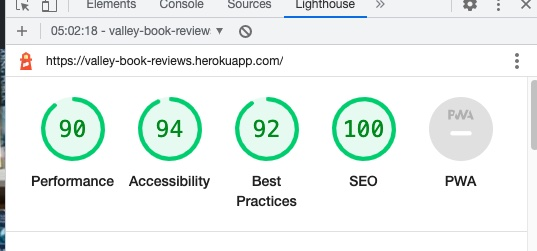

# Valley Book Reviews - `Testing Documentation`

The README documentation can be found here:- [README.md](./README.md)

[Click here to view website on Heroku](https://valley-book-reviews.herokuapp.com/).

---

# Table of contents

> 1.  [User Story Testing](#user-story-testing)
> 2.  [Feature Testing](#feature-testing)
> 3.  [Browser Testing](#browser-testing)
> 4.  [Automated Testing](#automated-testing)
> 5.  [Significant Bugs](#significant-bugs)

---

# User Story Testing

> As a potential new user, I would like the site to be easily usable, understandable and user friendly.
>
> - The website utilizing familiar icons commonly used on websites such as user for account details and hamburger menu for more options.
> - The website has a simple uncomplicated format which allows users further access once they have logged into thier accont.

> As a new user, I would like to be able to register an account to be able to use the site.
>
> - Once the user lands on the home page, there is a button for logging in or in the top right corner there is a user icon once clicked provides a menu to either register or login.
> - If the user clicks logon a click is available on the bottom that allows new users to be re-directed to the registeration sheet.

> As a current user, I would like to be able to submit new and vote on exisiting reviews on the site.
>
> - Once the user has logged in, the My Reviews page becomes available to them and at the top they are able to submit their own reviews.
> - In addition to the My Reviews page becoming available, the voting options will show in the 'My Reviews' and 'All Reviews' sheets.

> As a returning user, I would like to be able to edit or delete previous reviews that I submitted on the site.
>
> - Once the user has submitted a form, on the 'My Review' sheet next to each review they are able to edit or delete any review they have created.

---

# Feature Testing

| Feature            | Outcome           | Additional Comments                                                                                                                                                           |
| :----------------- | :---------------- | :---------------------------------------------------------------------------------------------------------------------------------------------------------------------------- |
| Side Bar           | Works as intended | On clicking the hamburger menu the side bar goes from left to right to provide more site options.                                                                             |
| Register Account   | Works as intended | On registering for a new account, users details are passed and stored into the database.                                                                                      |
| Log Into Account   | Works as intended | On inputting the correct login details the user is able to access the voting system and my reviews.                                                                           |
| Create New Reviews | Works as intended | The user is able to create a new review, once submited is stored on the db.                                                                                                   |
| Read Reviews       | Works as intended | Users are able to read all reviews submitted on All Reviews or see just thier own on My Reviews.                                                                              |
| Update Own Reviews | Works as intended | Users on the My Review sheet are able to update thier own reviews as once the button is clicked they are redirected to a new sheet where they are able to change the details. |
| Delete Reviews     | Works as intended | Should the user wish, on the My Revieew sheet they are able to delete previously submitted reviews.                                                                           |
| Voting on Reviews  | Works as intended | Users are able to vote either like or dislike on any reviews including thier own, they are able to do this on My Reviews or All reviews.                                      |

# Browser Testing

    All functionality worked as intended on Safari, Chrome, Firefox and Edge.

    As IE is not supported anymore this has not been tested.

---

# Automated Testing

> Automated testing was completed via the following third party applications:-
>
> - [W3 Markup Validation](https://validator.w3.org/) - For the HTML Vaildation.
> - [W3 Jigsaw](https://jigsaw.w3.org/css-validator/) - For the CSS Vaildation.
> - [JSHint](https://jshint.com/) - For the JavaScript Vaildation.
> - [Google Lighthouse](https://developers.google.com/web/tools/lighthouse) - For Performance, Accessibility, Best Practices, SEO and Progressive Web Apps.
> - [WAVE](https://wave.webaim.org/) - For Accessibility.

1.[W3 Markup Validation](https://validator.w3.org/) - Testing

    Document checking completed. No errors or warnings to show.

2.[W3 Jigsaw](https://jigsaw.w3.org/css-validator/) - Testing

    Congratulations! No Error Found.
    This document validates as CSS level 3 + SVG !

3.[JSHint](https://jshint.com/) - Testing

    No issues other than warnings regarding ES6+ such as const, let and arrow functions.

4.[Google Lighthouse](https://developers.google.com/web/tools/lighthouse) - Testing

5.[WAVE](https://wave.webaim.org/) - Testing

    Congratulations! No errors were detected! Manual testing is still necessary to ensure compliance and optimal accessibility.

---

# Significant Bugs

> ## Image URL Validation
>
> - When submitting a new review, users are able to input any text into the field which results in an error when looking to import he image to use in the review sheets.
> - Need to create either a JavaScript or Python soultion where it validates the url to make sure it's a vaild link for an image.

> ## Incorrect Password - `When Logging into the site`
>
> - When logged into the site, if an incorrect password is submitted the site attempts to redirect the users to 'My Reviews' but are not logged in.
> - Need to create validation logic that will check to see if the user has inputted a correct password if not will pass that back to the user to advise them without redirecting to the new sheet.

---

The README documentation can be found here:- [README.md](./README.md)

---
